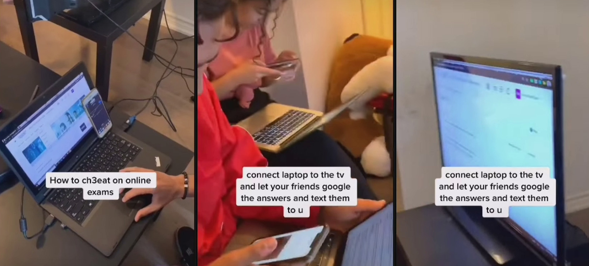
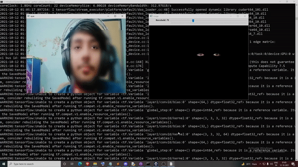
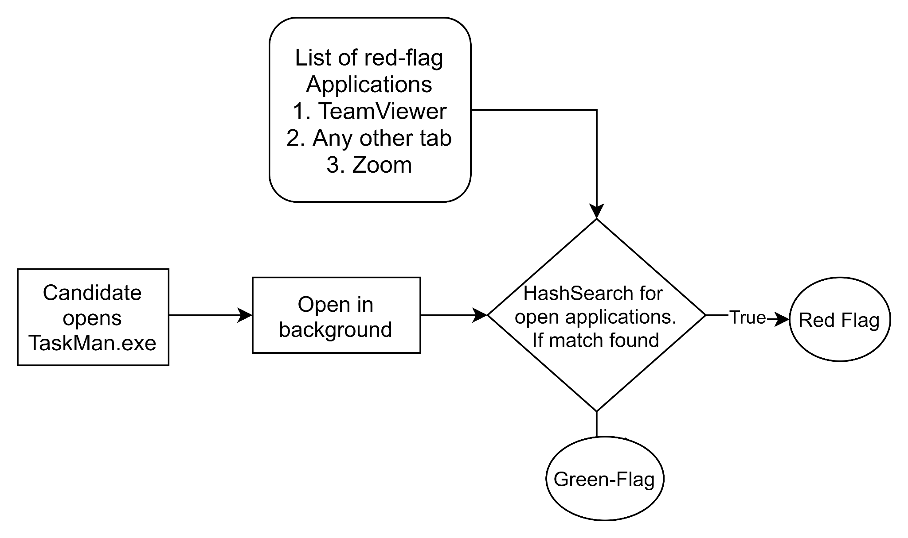

# Exam Proctoring
### Problem Statement : 
The onset of the pandemic has caused a paradigm shift in the way education is conducted. We have seen schools and colleges conducting classes online, and face various problems in operating as smoothly as they did traditionally. One of the factors which hinders this, is the lack of an effective proctoring system for exams conducted remotely. As part of this task, participants have to create an effective exam proctoring system to detect malpractices during conduction of an online exam.

### Abstract:
The COVID-19 pandemic has seen the rapid but sometimes controversial take-up of ‘online examination proctoring’ systems by universities keen to maintain their assessment schedules during times of campus closure. This project focuses on providing an automated and foolproof solution to exam proctoring.

1) We propose a privacy preserving approach for video based manual or automated proctoring, for anomaly detection like presence of another person or mobile phone.

2) To extend the dimensions of proctoring, we will attempt to make a software named ‘TaskMan’, which monitors the presence of a 3rd party app open on students' computers which may be used for cheating. The setup and data transmitted are in accordance to preserve the privacy of the candidate.

3) A dual-camera setup may also be adopted for a wider view of the candidate. This is feasible by using a phone as a camera.




# Auto-Proctoring


#### Person And Phone Detection.
- Trained COCO-128 dataset
- This file uses, YOLv5 model, trained on COCO dataset. 


#### Mouth Opening Detection

- Used pre-trained-CNN to detect 128 facial keypoints
- Predict mouth opening or close by setting threshold distance


#### Distraction Detector
- Used pre-trained-CNN to detect 128 facial keypoints
- Use Mutual PNP algorithm to detect alignment of head
- If head is aligned more than 45* in either direction, candidate is distracted


Below are the steps to run, AutoProctor.
Subset of files are present in AutoProctor directory, because of github file size limit.

Download all files from here https://drive.google.com/drive/folders/19NqlxuyvP2zRhPk53FGF-imhWS8rDwxl
### Steps to run:
Step 1: Crete virutal environment using ```python -m venv env```

Step 2: Activate virtual environment using: ```env\Scripts\activate.bat```

Step 3: ```pip install -r requirements.txt```

Step 4: ```python detect.py --source 0```

# Manual-Proctoring: Anonymize face for privacy


Below are the steps to run, Manual, files in the github directory /Manual_Proctor

Subset of files are present in AutoProctor directory, because of github file size limit.

### Steps to run:
Step 1: Crete virutal environment using ```python -m venv env```

Step 2: Activate virtual environment using: ```env\Scripts\activate.bat```

Step 3: ```python privacy_face_blur.py ```


# TaskMan: Monitor Background task

### Flowchart of working



